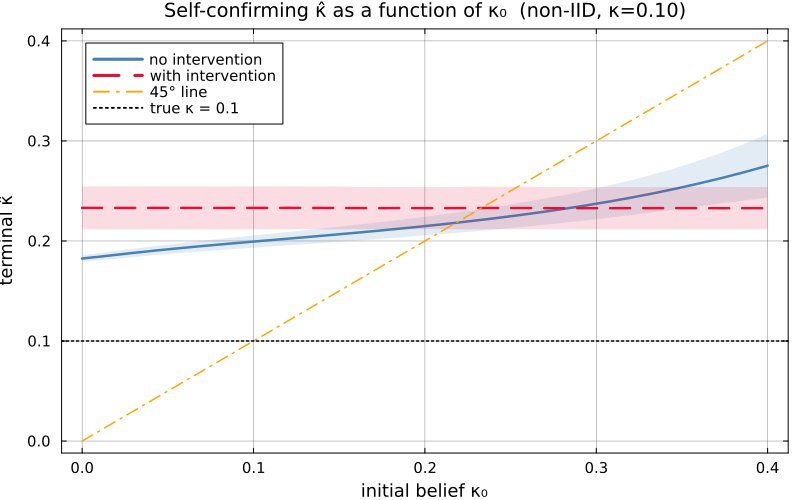

# SelfFulfillingNKPC.jl

[](https://github.com/nilufarslh/NKPC_SelfFullfilling_Econ622-Project/actions/workflows/CI.yml?query=branch%3Amain)
[](https://nilufarslh.github.io/NKPC_SelfFullfilling_Econ622-Project/dev/)
[](LICENSE)

Can the slope of the New Keynesian Phillips curve be identified from US macro data when the central bank's own learning about the slope shapes the data the econometrician sees? This package answers that question by estimating the slope under two monetary-policy regimes that differ only in whether the Taylor coefficient responds to the bank's real-time belief about the slope.

*ECON 622 final project, University of British Columbia. Niloufar Eslah.*

## The model

Structural equations:

$$
\pi_t = \beta \mathbb{E}_t \pi_{t+1} + \kappa y_t + \nu_t
$$

$$
r_t = \phi_\pi(\hat\kappa_t) \pi_t + \phi_y y_t + u_t
$$

| Symbol                    | Meaning                                                                |
|---------------------------|------------------------------------------------------------------------|
| $\pi_t, y_t, r_t$         | CPI inflation, CBO output gap, Fed Funds rate (quarterly, demeaned)   |
| $\kappa$                  | structural NKPC slope; **the object of interest**                      |
| $\beta$                   | household discount factor (calibrated)                                 |
| $d_t, \nu_t$              | AR(1) demand and cost-push shocks, persistences $\rho_d, \rho_\nu$    |
| $m^y_t, m^\pi_t$          | iid measurement errors on $y$ and $\pi$, entering $u_t$               |
| $u_t$                     | composite policy residual, $u_t = \phi_\pi m^\pi_t + \phi_y m^y_t$     |
| $\hat\kappa_t$            | central bank's real-time estimate of $\kappa$                          |
| $\phi_\pi(\hat\kappa_t)$  | Taylor coefficient on inflation, set optimally given the CB's belief  |

The output gap $y_t$ follows a reduced-form equation driven by the demand shock $d_t$; full derivation in [`REPORT.pdf`](REPORT.pdf).

## The feedback loop

The central bank chooses $\phi_\pi$ using its best estimate $\hat\kappa_t$ of the slope. That policy shapes the equilibrium data $(\pi_t, y_t, r_t)$. The econometrician then estimates $\kappa$ from those same data. Different initial beliefs can sustain different equilibria; hence *self-fulfilling*. The econometric task is to recover the structural $\kappa$ from inside this loop.

## Two regimes

To isolate the role of the feedback, two otherwise-identical estimation cases are compared. In Case 1 the central bank never updates its Taylor coefficient. In Case 2 it re-optimises the coefficient every period as its belief $\hat\kappa_t$ evolves.

| Case                        | Policy rule                                                        | Moment weight $W$                       | # Starts |
|-----------------------------|--------------------------------------------------------------------|-----------------------------------------|---------:|
| `case1_no_intervention`     | $\phi_\pi$ frozen at $\phi_\pi(\hat\kappa_0)$                      | $\mathrm{diag}(1/\lvert\hat m\rvert)$   |       20 |
| `case2_with_intervention`   | $\phi_\pi(\hat\kappa_t)$ re-optimised every period                 | $I$                                     |       10 |

Both cases estimate the same seven structural parameters: the slope $\kappa$, the two AR(1) persistences $\rho_d, \rho_\nu$, the two structural-shock volatilities $\sigma_d, \sigma_\nu$, and the two measurement-error volatilities $\sigma_{m^y}, \sigma_{m^\pi}$. The estimator matches eleven empirical moments $\hat m$ computed from a trivariate VAR(1) on $(\pi, y, r)$ against their model-implied counterparts $m(\theta)$. $W$ is the weight matrix in the SMM criterion; "# Starts" is the number of initial points for the multi-start optimiser.

## What the mechanism predicts

Before estimating on real data, consider what the two regimes do at a known illustrative calibration ($\kappa = 0.10$). At each initial belief $\kappa_0$, simulate forty sample paths, run the bank's learning recursion, and record the terminal belief $\hat\kappa$. Averaging across seeds and plotting against $\kappa_0$:

<p align="center">
  
</p>

- **Passive policy traces the $45^\circ$ line.** Terminal $\hat\kappa$ rises with $\kappa_0$: the bank ends where it started. The data it observes are shaped by a policy that never reacts to learning, so every initial belief is self-confirming.
- **Active policy collapses the curve to a horizontal line at $\hat\kappa \approx 0.23$.** Once the Taylor coefficient moves with $\hat\kappa_t$, the equilibrium stops depending on $\kappa_0$. The feedback loop is broken by endogenous policy, not by accumulating data.
- **Both regimes settle slightly above the true $\kappa = 0.10$**, a small upward recursive-IV bias under persistent shocks. It is flat across $\kappa_0$ under active policy and rising in $\kappa_0$ under passive policy, so it does not confound the comparison.

## Estimates on US data

Applying the same two-regime design to US quarterly data 1984Q2–2025Q2 ($T = 166$):

| Regime              | $\hat\kappa$ | bootstrap SE | $t$ vs $0$ | verdict                              |
|---------------------|-------------:|-------------:|-----------:|--------------------------------------|
| Passive (Case 1)    |        0.051 |        0.303 |       0.17 | cannot reject a flat Phillips curve |
| Active (Case 2)     |        0.611 |        0.274 |       2.23 | rejects $\kappa = 0$ at the 5% level |

A factor-of-twelve jump in the point estimate, driven entirely by whether the central bank reacts to its own learning. The passive-regime moments are governed by the shock process alone and leave $\kappa$ unidentified; the active-regime moments carry the signature of a belief-responsive Taylor rule, which is what pins the structural slope down. This is the self-fulfilling channel of Beaudry, Hou, and Portier (2020) rendered in empirical form. Full identification analysis and per-moment fit diagnostics are in [`REPORT.pdf`](REPORT.pdf).

## Estimation method

Single-stage SMM on the eleven targeted moments. Exact gradients via ForwardDiff, including through the central bank's inner policy problem, which is approximated by a 31-point linear interpolant of $\phi_\pi(\hat\kappa)$ to keep the SMM objective differentiable. Outer optimisation is multi-start Fminbox(L-BFGS) with a fixed sequence of multipliers applied to the prior mean. Standard errors come from a 20-replicate nonparametric bootstrap, parallelised across threads.

## Reproduce

Requires Julia ≥ 1.10. From a clone of this repository:

| # | Step                     | Command                                                         | Runtime (4 threads) |
|---|--------------------------|-----------------------------------------------------------------|---------------------|
| 1 | Instantiate environment  | `julia --project=. -e 'using Pkg; Pkg.instantiate()'`           | once                |
| 2 | Estimate both cases      | `julia --project=. -t auto run_estimation.jl`                   | ~45–60 min          |
| 3 | Run the test suite       | `julia --project=. -t auto test/runtests.jl`                    | ~3–5 min            |
| 4 | Regenerate figures       | `julia --project=. -t auto scripts/fig_report.jl`               | ~1 min              |

Step 2 runs Case 1 (20 L-BFGS starts) and Case 2 (10 starts) in sequence, each followed by a 20-replicate threaded bootstrap for standard errors. Runtime scales with threads; on a single core expect roughly 2–3× these numbers.

Seeds are fixed. The numbers in the US-data table above are reproduced exactly by step 2; the figure in "What the mechanism predicts" is regenerated by step 4.

To use the package as a dependency in another project:

```julia
using Pkg
Pkg.add(url = "https://github.com/nilufarslh/NKPC_SelfFullfilling_Econ622-Project")
```

## Cite

```bibtex
@misc{eslahi2026selffulfillingnkpc,
  author       = {Eslahi, Niloufar},
  title        = {{SelfFulfillingNKPC.jl}: SMM estimation of a self-fulfilling New Keynesian Phillips curve with central-bank learning},
  year         = {2026},
  note         = {ECON 622 final project, University of British Columbia},
  howpublished = {\url{https://github.com/nilufarslh/NKPC_SelfFullfilling_Econ622-Project}}
}
```

MIT © 2026 Niloufar Eslahi.
